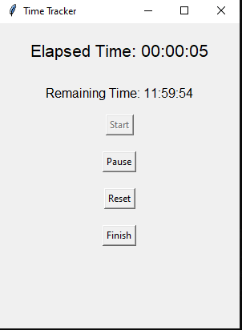

# TimeTracker



This Python script implements a simple time tracking GUI application using the tkinter library. It allows users to track their work time for a target duration of 12 hours. The application provides functionalities to start, pause, reset, and finish the timer. It also displays the elapsed time and remaining time during the session and writes the total worked time to an output file (output.txt). Additionally, a new button "Show Logs" has been added to display the contents of the output file.

#### Features:

```bash
-Start Timer: Starts the timer, tracking elapsed time.
-Pause Timer: Pauses the timer, allowing users to resume later.
-Reset Timer: Resets the timer to zero, clearing elapsed and remaining time.
-Finish Timer: Stops the timer, calculates total worked time, and writes it to the output file.
-Elapsed Time Display: Shows the elapsed time in hours, minutes, and seconds.
-Remaining Time Display: Shows the remaining time (target - elapsed) in hours, minutes, and seconds.
-Target Work Time: Set to 12 hours, configurable by modifying the target_work_hours variable.
-Output File: Saves the total worked time to "output.txt" upon finishing.
-Show Logs: Opens a new window to display the contents of "output.txt".
```


